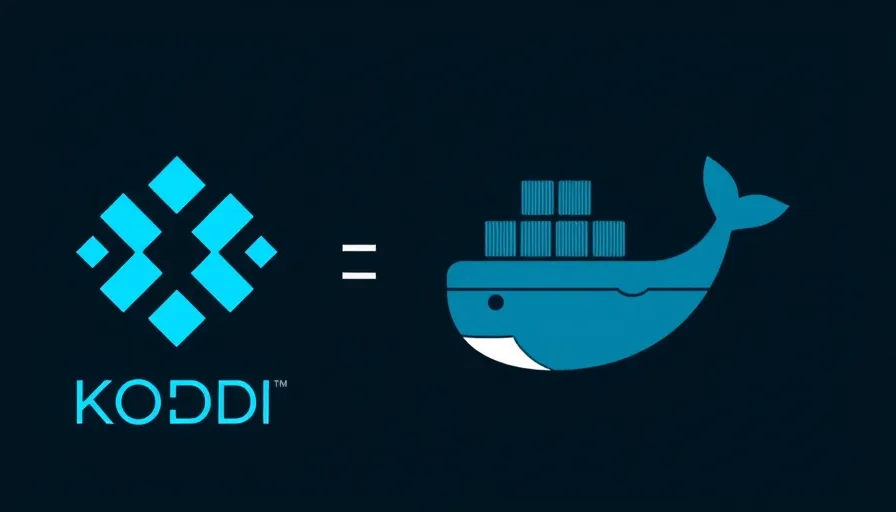

# Docker Kodi: Your Ultimate Kodi Experience in a Container

This repository contains everything you need to deploy Kodi in a Docker container, offering a flexible and portable way to run your favorite media center on various systems. With this setup, you can enjoy Kodi's powerful features without the hassle of traditional installation methods.

## Repository Contents

- **`Dockerfile`**: Instructions for building the Kodi Docker image, allowing you to specify the Kodi version you want to use.
- **`Dockerfile.nvidia`**: A specialized Dockerfile that builds an image with NVIDIA support for hardware acceleration, enhancing performance on compatible systems.
- **`docker-compose.yml`**: Defines the services, networks, and volumes for easy deployment, simplifying the setup process.
- **`entrypoint.sh`**: The entry point script for the Docker container, responsible for starting Kodi.
- **`pulseaudio.client.conf`**: Configuration file for the PulseAudio client, ensuring optimal audio performance.
- **`kodi_files/`**: A directory containing Kodi configuration files and add-ons, allowing for easy customization and persistence of your Kodi setup.

## Deployment Instructions

1. Clone this repository:
   ```
   git clone https://github.com/bpawnzZ/docker-kodi.git
   cd docker-kodi
   ```

2. Build the Docker image:
   ```
   docker buildx build -t bpawnzZ/kodi:tag .
   ```
   Replace `tag` with your desired tag.

3. If you need NVIDIA support, use the `Dockerfile.nvidia` instead:
   ```
   docker buildx build -f Dockerfile.nvidia -t bpawnzZ/kodi-nvidia:tag .
   ```

4. Set the KODI_DATA environment variable (optional):
   ```
   export KODI_DATA=/path/to/your/kodi/data
   ```
   If not set, it will default to `./kodi_files` in the current directory.

5. Run the container using Docker Compose:
   ```
   docker-compose up -d
   ```

## Configuration

### Setting Up PulseAudio Socket

To enable audio support in your Kodi Docker container, you need to create a PulseAudio socket. This can be done using the following command:

```bash
pactl load-module module-native-protocol-unix socket=/home/insomnia/docker/kodi/pulseaudio.socket
```

This command loads the `module-native-protocol-unix` module, which allows PulseAudio to communicate over a Unix socket. The specified socket path is where the PulseAudio server will listen for connections from the Kodi container.

To ensure that this command runs automatically on system reboot, you can use a cron job. Here’s how to set it up:

1. Open your crontab for editing:
   ```bash
   crontab -e
   ```

2. Add the following line to run the command at reboot:
   ```bash
   @reboot pactl load-module module-native-protocol-unix socket=/home/insomnia/docker/kodi/pulseaudio.socket
   ```

This will ensure that the PulseAudio socket is created every time your system starts, allowing Kodi to access audio services seamlessly.

Before running the container, you may need to modify the following:

1. Edit the `kodi_files/userdata/advancedsettings.xml` file to customize Kodi settings.
2. Modify the `docker-compose.yml` file to adjust volume mappings and environment variables as needed.

The `docker-compose.yml` file now uses a more generic approach for volume mappings:
- It uses the `KODI_DATA` environment variable to set the Kodi data directory.
- PulseAudio socket is mapped using `${XDG_RUNTIME_DIR}/pulse/native`.
- The PulseAudio client configuration is mapped from the local `pulseaudio.client.conf` file.

## NVIDIA Support

The `Dockerfile.nvidia` includes NVIDIA runtime support, allowing hardware acceleration for systems with NVIDIA GPUs. Make sure you have the NVIDIA Container Toolkit installed on your host system.


## Contributing

Contributions are welcome! Please feel free to submit a Pull Request.

## License

This project is licensed under the MIT License - see the LICENSE file for details.
